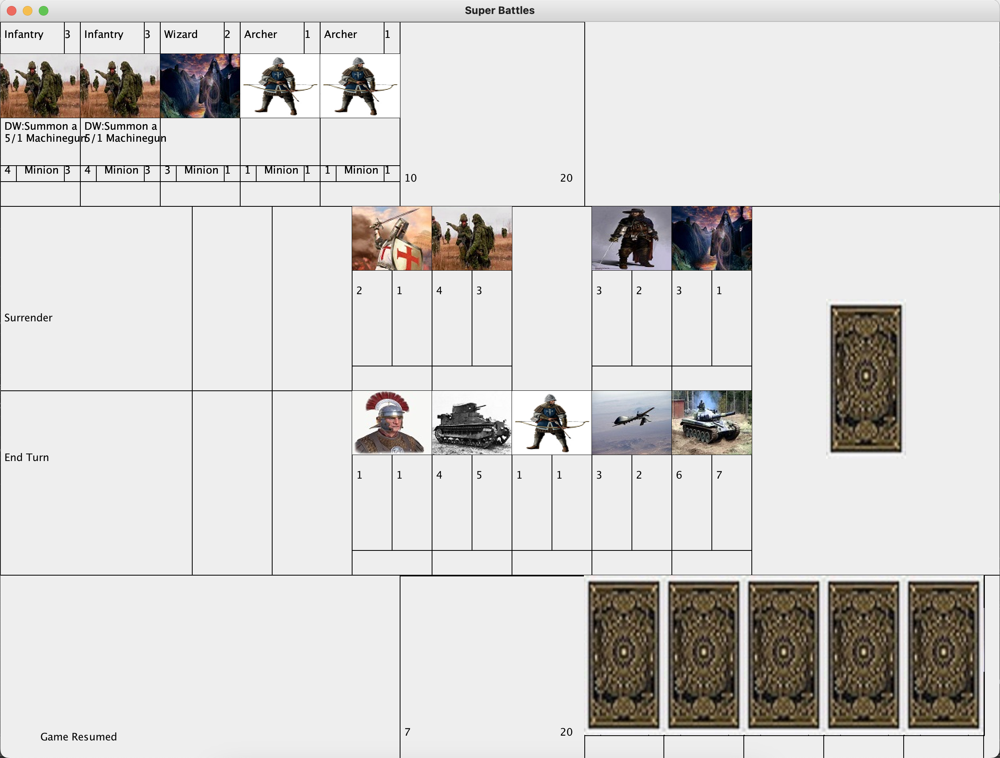

# SuperBattles

SuperBattles is a program written in Java, intended as a card game in a similar vein to Activision-Blizzard's Hearthstone. The project was written by myself between late 2017 and early- to mid-2018 as the final assignment for a computer science course in high school.

It tested my skills at the time, consisting of loading files, opening windows and drawing objects at a scale I had never done before. Several extra files were created as libraries, and the final version even included background music (which has since stopped working, pending repair), and extra cards from intellectual properties I enjoyed consuming at the time (which have been removed, without plans for replacement).

The program made heavy use of JFrames for its graphics, as well as reading in JPEGs for card artwork. The AWT and Swing libraries were used very often. IO was used as well, as the entirety of the game's controls use mouseclicks - hence the need for MouseListener.

If I were to do this program over again, I would likely include more use input feedback - maybe a button click noise or a visual indication of when a card is selected. The game's design itself also needs work.
